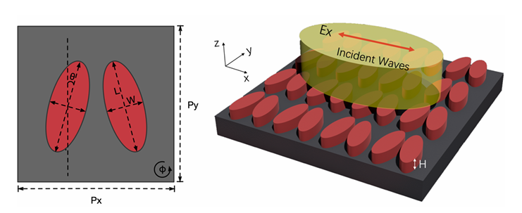
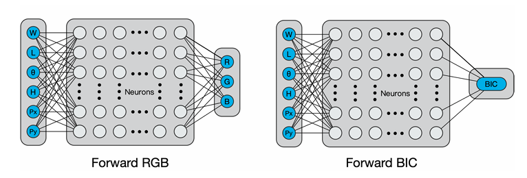
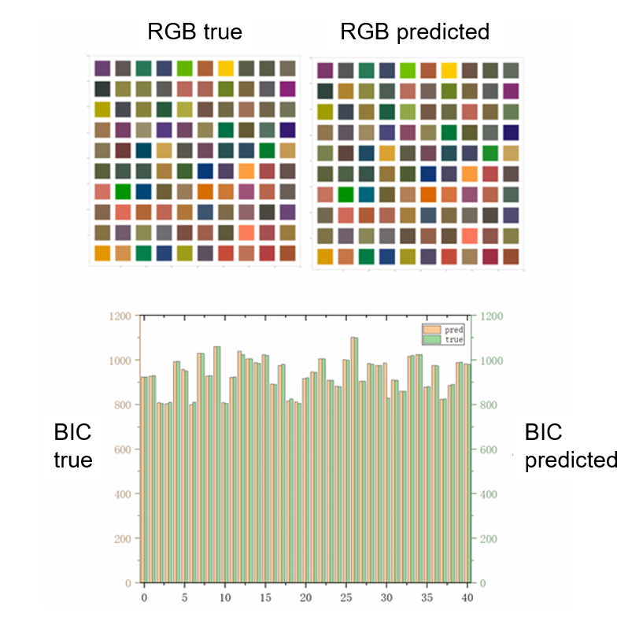
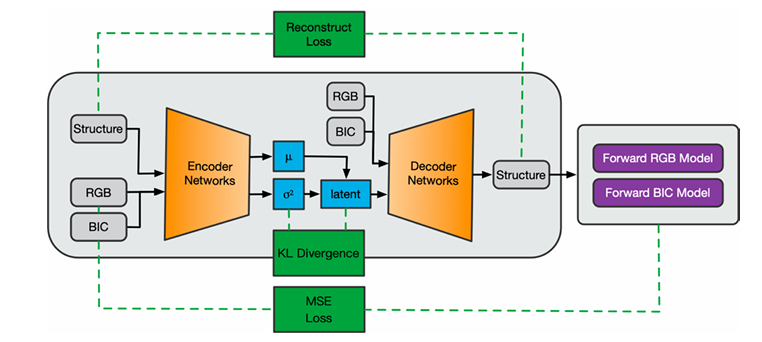
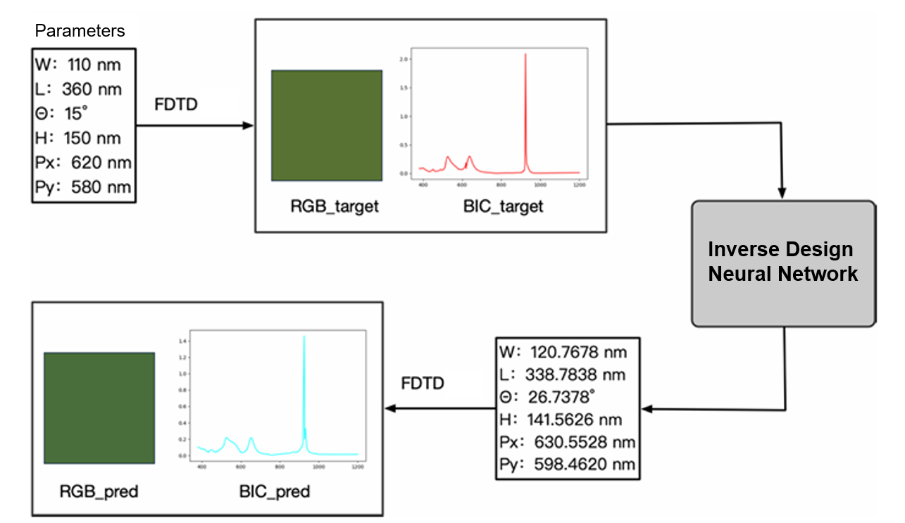
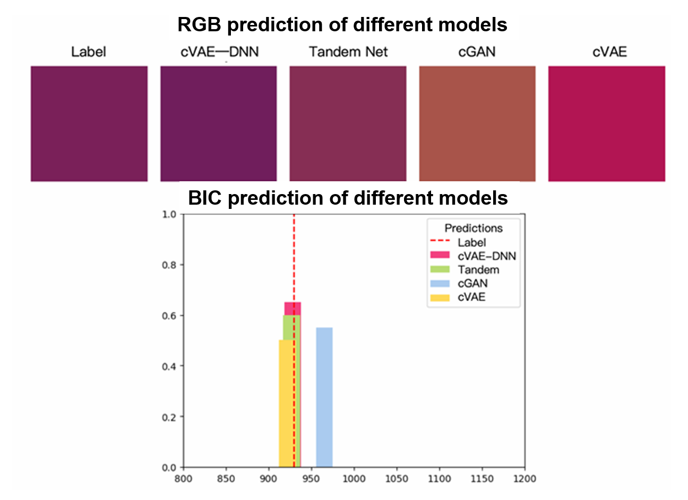
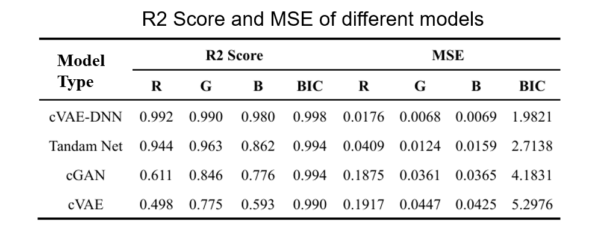

# VAE for Optical Inverse Design

## Background

In the visible light region, double-elliptical structures can excite high-quality Mie resonances. 
The significant enhancement of local electromagnetic fields and steep spectral edges render the exhibited structural colors saturated, distinct, pure, and stable.

In the near-infrared region, by tuning the rotation angles and relative positions of the double ellipses to introduce moderate asymmetry, the fully protected bound states in the continuum (BIC) modes under strictly symmetric conditions can be transformed into quasi-BIC modes with finite radiative coupling yet high Q-factors. 
The formation of this mode relies on the precise matching of geometric parameters, which enables effective interference of radiative channels among different resonant modes under specific conditions, partially offsetting radiative losses and thereby forming narrowband, high-quality reflection peaks in the near-infrared band.

Achieving both the desired structural colors and BIC resonance peaks simultaneously in arrays of double-elliptical structures is a complex task.
This study demonstrates that one-step optimization and design can be realized through inverse design.

## Project Introduction

This project implements deep learning methods—especially Variational Autoencoders (VAE), conditional GANs (cGAN), and tandem networks—for the inverse design of optical structures. The goal is to map desired optical properties (like color and BIC) to physical design parameters, using neural networks trained on simulation or experimental data. The codebase supports both forward modeling (predicting optical properties from structure) and inverse modeling (designing structures for target properties), with experiment tracking and evaluation utilities.

## Code Structure

### Core Training & Modeling Scripts

- **forward_color.py**  
  Trains and evaluates a neural network to predict color properties from structural parameters (forward model for color).

- **forward_BIC.py**  
  Trains and evaluates a neural network to predict BIC (Bound State in the Continuum) properties from structure (forward model for BIC).

- **cVAE.py**  
  Implements and trains a conditional Variational Autoencoder for inverse design, mapping optical properties to structure.

- **cVAE_hybrid.py**  
  Trains a hybrid VAE model that combines forward color and BIC models with a VAE for improved inverse design.

- **cGAN.py**  
  Implements and trains a conditional GAN for inverse design, generating structures from target optical properties.

- **tandem.py**  
  Trains a tandem network that combines pre-trained forward models with an inverse model for end-to-end inverse design.

### Model Definitions

- **models.py**  
  Contains all neural network architectures: MLPs for color/BIC, cVAE, cVAE_hybrid, GAN components, and tandem networks.

### Data Handling

- **datasets.py**  
  Defines PyTorch Dataset classes for various data types (Color, BIC, Binary, WidthHeight, SiliconColor) and provides data loaders.

### Utilities

- **utils.py**  
  Provides evaluation functions for all model types (forward, VAE, GAN, tandem), including RMSE calculations and result formatting.

- **plotting_utils.py**  
  Contains plotting functions for visualizing prediction errors and R² scores for model evaluation.

## Evaluation

### Forward Prediction

The inputs of both the Forward_RGB and Forward_BIC forward neural networks are the 6 normalized structural parameters (𝑊, 𝐿, 𝜃, 𝐻, 𝑃𝑥, 𝑃𝑦). The output of Forward_RGB is the normalized RGB value, while the output of Forward_BIC is the normalized spectral band value corresponding to the BIC peak.

We selected a large number of test samples. The true values refer to the RGB and BIC information extracted from the optical responses obtained by simulating the structural parameter information in FDTD. The predicted values refer to the RGB and BIC information output after inputting our structural parameters into the model for prediction. From the results, it can be seen that within the visible light spectrum, the colors predicted by the model are almost identical to the actually measured colors. Meanwhile, the errors of the spectral values corresponding to the BIC peaks are all controlled within 1. 

### Tandem: Backward Design + Forward Prediction

Our model mainly consists of two major components: one is the conditional Variational Autoencoder (cVAE), and the other is the forward prediction model based on a Deep Neural Network (DNN). Among them, the cVAE is composed of an encoder, a decoder, and a reparameterization module.  

In the training phase, we take the real structure and the corresponding optical parameters (RGB values and BIC values) as inputs. Through the encoder module, the information of the real structure is compressed into a low-dimensional latent space via multi-layer nonlinear transformations. During this process, the encoder not only extracts the main features of the structure but also integrates the optical parameters as conditional information. This enables the latent space to capture the intrinsic variability and uncertainty among different structures under the same optical conditions.  

Subsequently, the latent space module generates a set of latent variable distribution characteristics for each sample through variational inference, thereby introducing randomness. This allows the model to generate multiple reasonable structural candidates even when facing the same RGB and BIC values. This random sampling mechanism is crucial for reflecting the multimodal characteristics in inverse design, as the same set of optical parameters often corresponds to multiple potential structures. Next, the decoder module combines the sampled latent variables with the conditional information of the optical parameters. After nonlinear mapping, it reconstructs the target structure, completing the transformation task from optical parameters to structure.  

During the training process, we employ three loss measurement methods to ensure the rationality and diversity of the generated structures. First, the Reconstruction Loss ensures that the generated structures are highly realistic in terms of physical characteristics by comparing the differences in details and overall features between the structures generated by the decoder and the real structures. For example, in the mapping task from RGB values to structures, the Reconstruction Loss helps the model capture the subtle corresponding relationships between color information and structures; in the mapping task from BIC values to structures, it prompts the model to accurately restore the structural details that reflect key spectral features. Second, the KL Divergence Loss is used to measure the difference between the latent variable distribution and the preset prior distribution. Through this regularization method, the latent space remains smooth and continuous, thus preventing the model from overfitting during training and ensuring the coherence and physical rationality of the structures generated under different optical conditions. Finally, we input the structural parameters output by the cVAE model into the forward prediction model. The error between the optical responses generated by the predicted structures and the expected responses (measured by the MSE Loss) is utilized to further constrain the model’s generation process.

To verify the performance of our trained inverse model, we randomly selected a structure from the test set that did not participate in the model training for verification. First, we input the randomly selected structure into FDTD for simulation to obtain the corresponding spectral response and extract the relevant information of RGB and BIC. Then, we take RGB and BIC as the required design targets and feed them into the inverse neural network, through which the corresponding design parameters can be obtained. Similarly, we input these parameters into FDTD for simulation to get the optical response results. It can be seen that, compared with the original design targets of RGB and BIC, although the structure output by our model is different from the structure of the design target, the final presentation in terms of RGB and BIC is almost identical. This also verifies that our model has better accuracy and generalization ability.

### Comparison among Models

In the experiment of randomly selecting test samples, we input the same set of optical parameters (RGB values and BIC values) into each model respectively. The obtained structural parameters were then fed into FDTD for simulation, and the resulting outcomes are illustrated in the figures. 

From these results, it can be seen that our cVAE–DNN model, in terms of color restoration and the prediction accuracy of BIC values, is very close to the label values. This indicates that our model can better capture the information contained in the optical parameters and demonstrate higher diversity and physical rationality. In contrast, the traditional Tandem Net, cGAN, and the model using cVAE alone are slightly deficient in detail processing and multimodal generation, with some of their generated results showing obvious deviations.

We quantitatively evaluated the prediction performance of each model by calculating the R² Score and Mean Squared Error (MSE) for the RGB channels and BIC values, and summarized the results in the Table. As can be seen from the table, our cVAE-DNN method achieves significant advantages across all metrics: it attains higher R² Scores and lower MSEs for the R, G, and B channels. Notably, it exhibits exceptional performance in predicting BIC values, with an R² Score reaching 0.998 and an MSE of only 1.9821. These data demonstrate that the inverse network integrating cVAE and DNN can not only maintain high prediction accuracy in the mapping task from RGB/BIC values to structures but also effectively capture structural information under the multi-solution scenario (where multiple potential structures correspond to the same optical parameters).

